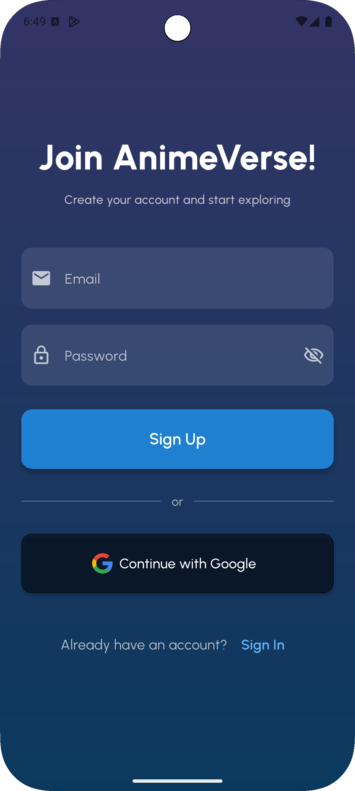
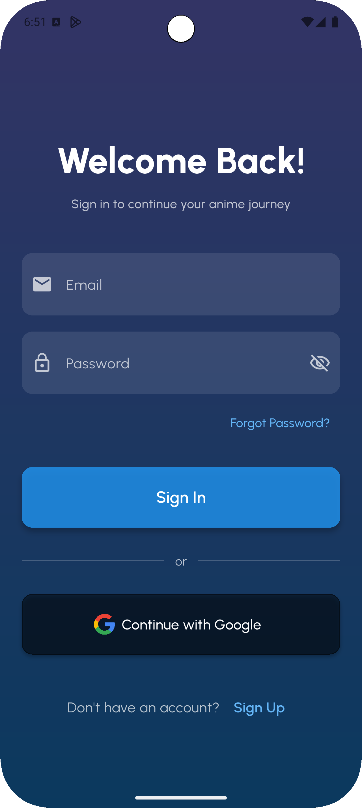
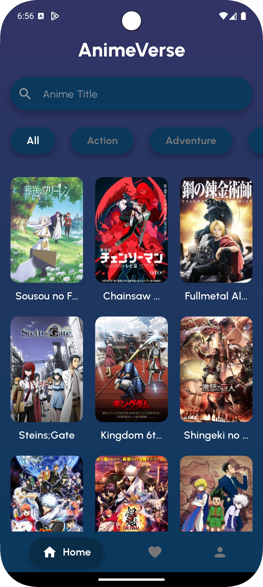
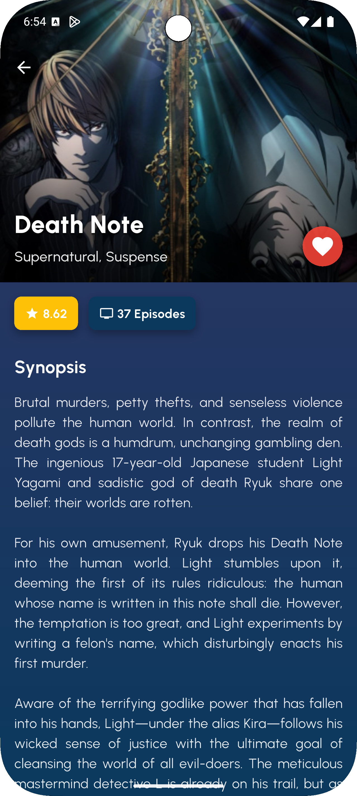
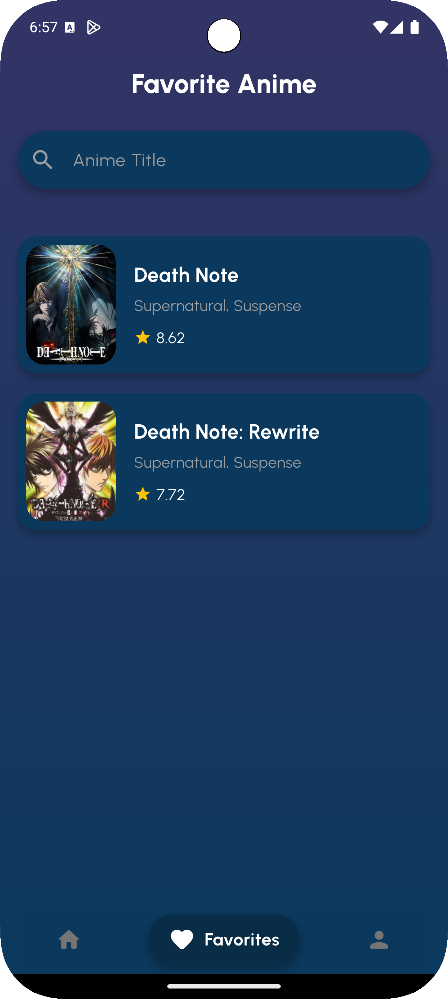
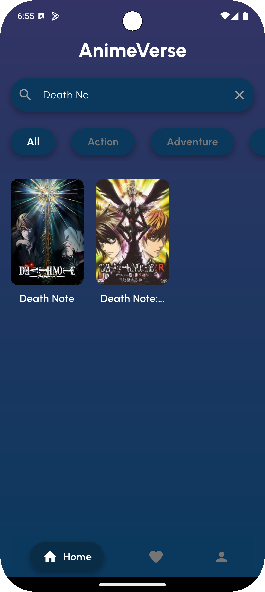
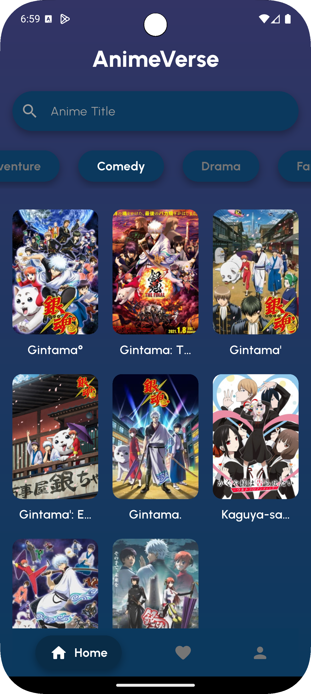
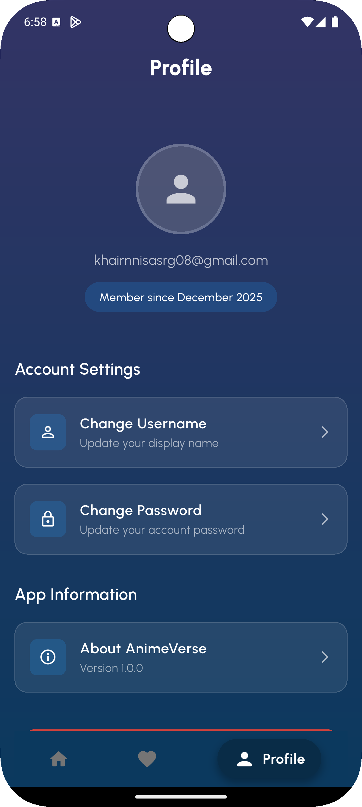

# AnimeVerse

AnimeVerse is an anime discovery and favorite-management application built with Flutter.  
The app integrates API data from Jikan (MyAnimeList) and uses Firebase Authentication and Cloud Firestore to store user information and personal favorite lists.  
Designed with a clean interface and simple flow, AnimeVerse demonstrates essential Flutter development concepts for mobile applications.

---

## Application Overview

- **Application Name:** AnimeVerse
- **Platform:** Flutter
- **Category:** Anime Browser & Favorite Collection
- **Purpose:** Provide a smooth and intuitive experience to browse anime, view details, search titles, filter by genres, and manage user-specific favorites.

---

## Description

AnimeVerse allows users to sign in using Email/Password or Google Sign-In.  
Once logged in, users can browse anime, view details including synopsis, ratings, and genres, and mark their favorite anime for later viewing.  
All favorites are stored in Firebase Firestore and synchronized per user.

**Main Screens Included:**

- Sign In / Sign Up
- Home (Anime List with pagination)
- Search
- Genre Filter
- Anime Detail
- Favorites
- Profile & Logout
- Forgot Password
- Change Password

---

## Screenshots

| Splash | Sign Up | Sign In |
|--------|---------|---------|
|  |  |  |

| Home | Detail | Favorites |
|------|--------|-----------|
|  |  |  |

| Search | Genre | Profile |
|--------|--------|---------|
|  |  |  |


## Demo Video

**Video Link:** [Watch the AnimeVerse Demo Video Here](https://drive.google.com/drive/folders/175RNqozS1n9vdHJwjq8fFnOe_0lgk_9A?usp=drive_link)

---

## Features

- Email & Google Authentication
- Anime browsing with pagination
- Search functionality
- Genre-based filtering
- Detailed anime information
- Cloud-based favorites (Firestore)
- Profile management & logout
- Reset and change password
- Clean and minimal UI design

---

## Tech Stack

- Flutter
- Dart
- Firebase Authentication
- Cloud Firestore
- Jikan API (MyAnimeList)
- Material Design

---

## How to Run & APK Release

1. Clone the repository
   ```bash
   git clone https://github.com/KhairunnisaS/AnimeVerse_Mobile.git
   cd animeverse
2. Install dependencies and run the app
    ```bash
    flutter pub get
    flutter run
    ```
3. Add firebase configuration
   Place your ```google-services.json``` file in ```android/app/```
4. APK Release
   The release APK (v1.0.0 or higher) should be uploaded in GitHub Releases.
---

## ⚙️ Firebase Configuration

Ensure you have configured Firebase correctly:

1.  Create a new project in the **Firebase Console**.
2.  Enable **Authentication** (Email/Password & Google Sign-In providers).
3.  Set up **Cloud Firestore** (ensure the *security rules* are configured for read/write access).
4.  Add application configuration files:
    *   Place the `google-services.json` file in the `android/app/` directory.
    *   If targeting iOS, place the `GoogleService-Info.plist` file in the `ios/Runner/` directory.

---

## Final Notes

This project was completed as the Final Project for the Mobile Programming course.
AnimeVerse demonstrates API integration, Firebase Authentication, Firestore operations, and practical UI development using Flutter.

© 2025 Khairunnisa Siregar — 231401118
**Universitas Sumatera Utara**
